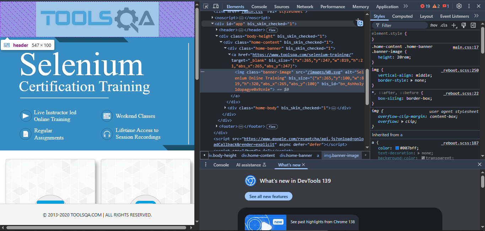
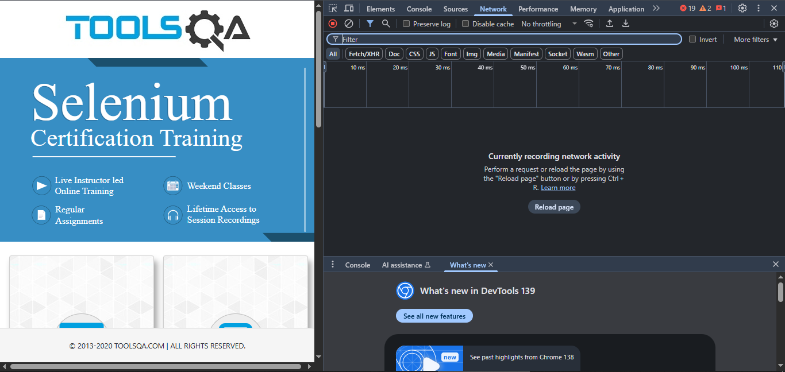

# Day 1: Chrome DevTools Exploration

## Overview
This section documents my hands-on exploration of Chrome DevTools as part of my 30-day SQA learning journey.

## What I Learned
1. **Elements Tab**: Inspected web elements, modified HTML/CSS in real-time, and identified locators
2. **Console Tab**: Executed JavaScript commands and debugged errors
3. **Network Tab**: Monitored API calls and analyzed request/response patterns

## Practical Exercises Completed
- Inspected elements on DemoQA.com and Amazon India
- Used Console tab to execute basic JavaScript commands
- Monitored network activity during website interactions

## Screenshots

## Key Takeaways
- DevTools is an essential tool for web testing
- I can identify UI elements and their properties for test automation
- Understanding network tab helps in API testing
- Console tab is valuable for debugging front-end issues
