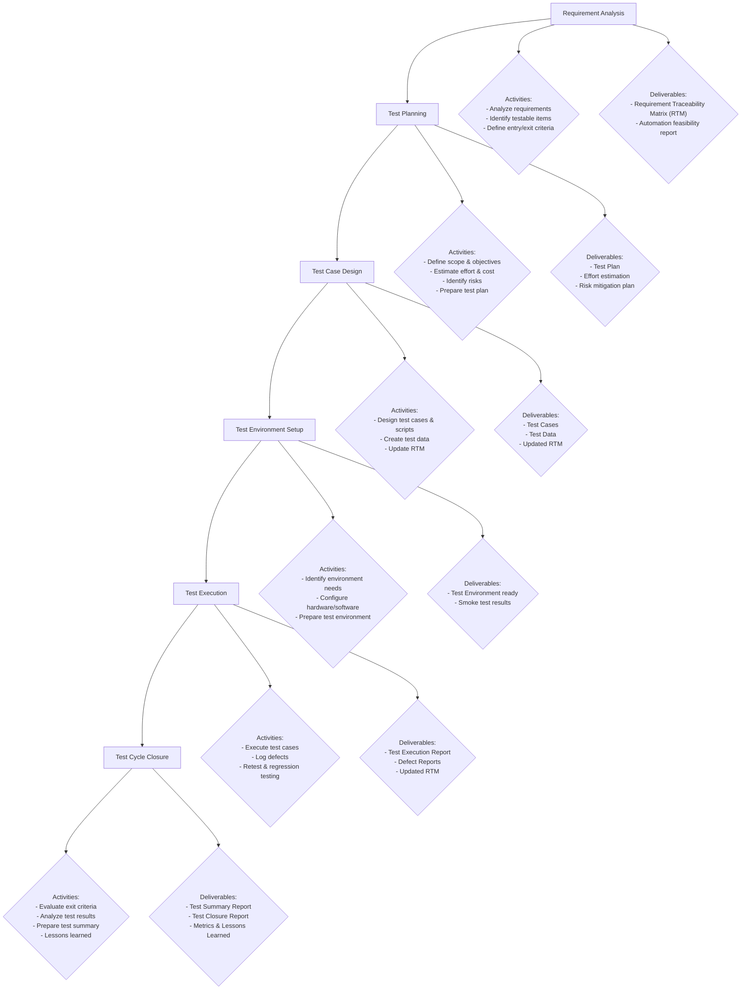

# STLC (Software Testing Life Cycle)

## 📌 What is STLC?
STLC (Software Testing Life Cycle) is a sequence of activities performed during the testing process to ensure software quality.

It typically includes:
- Requirement Analysis
- Test Planning
- Test Case Design
- Environment Setup
- Test Execution
- Defect Reporting & Tracking
- Test Closure

## 📌 Real Example: Testing a Login Page

### 1. Requirement Analysis
- **Requirement:** The user must be able to log in with valid username & password.
- Invalid credentials should show an error message.
- Password must be masked.
- Login should redirect to the dashboard after success.

### 2. Test Planning
- Decide what to test (positive & negative login scenarios).
- Tools: Selenium + TestNG (automation) or manual test cases.
- Roles: QA team assigned.
- Risks: Server downtime, browser compatibility issues.

### 3. Test Case Design
**Example test cases:**
- Valid username + valid password → should login.
- Valid username + invalid password → error message.
- Empty username/password → validation error.
- Check password is masked.
- After login → redirect to dashboard.

### 4. Environment Setup
**Setup:**
- Test server URL: `https://test.app.com/login`
- Browsers: Chrome, Firefox, Edge
- Database with test user credentials

### 5. Test Execution
- Execute test cases manually/automated.
- Record pass/fail results.

### 6. Defect Reporting
**Example:**
- **Bug:** Password is visible instead of masked.
- **Bug:** Invalid login redirects to dashboard instead of showing error.

### 7. Test Closure
- Prepare final test summary report.
- Coverage: 100% of login scenarios tested.
- No major defects remain open.

## 📌 STLC Mermaid.js Diagram

Here’s a Mermaid flowchart you can use directly:

