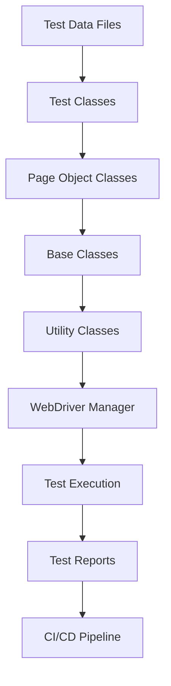

# 🤖 Automation Testing Portfolio

This directory demonstrates my **Test Automation expertise** using Selenium WebDriver, TestNG framework, and advanced automation patterns for scalable test solutions.

## 📂 What's Inside

```
03-Automation-Testing/
├── README.md                     # This file - automation testing overview
├── Selenium-Java-WebDriver/
│   ├── BasicSeleniumScripts/     # Fundamental WebDriver operations
│   ├── AdvancedInteractions/     # Complex user interactions and scenarios
│   ├── CrossBrowserTesting/      # Chrome, Firefox, Edge compatibility tests
│   └── MobileResponsiveTesting/  # Responsive design validation scripts
├── TestNG-Framework/
│   ├── TestNGSuites/            # XML test suite configurations
│   ├── DataDrivenTests/         # Excel/CSV data-driven test cases
│   ├── ParameterizedTests/      # TestNG parameters and groups
│   └── ParallelExecution/       # Multi-thread test execution setup
├── Page-Object-Model/
│   ├── PageObjects/             # POM classes for different pages
│   ├── BaseClasses/             # Common methods and utilities
│   ├── TestClasses/             # Test implementation using POM
│   └── Utilities/               # Helper methods and configurations
├── Test-Reports/
│   ├── ExtentReports/           # Rich HTML test execution reports
│   ├── TestNG-Reports/          # Default TestNG reporting
│   ├── Allure-Reports/          # Advanced test reporting with Allure
│   └── Screenshots/             # Failure screenshots and evidence
├── Framework-Architecture/
│   ├── ConfigFiles/             # Properties and configuration files
│   ├── TestData/                # Test data files (Excel, JSON, CSV)
│   ├── Drivers/                 # WebDriver executables management
│   └── Logs/                    # Application and test execution logs
└── CI-CD-Integration/
    ├── JenkinsFiles/            # Jenkins pipeline configurations
    ├── GitHubActions/           # GitHub Actions workflow files
    └── DockerFiles/             # Containerized test execution setup
```

## 🎯 **Automation Testing Approach**

### **Framework Design Principles:**
- **Modular Architecture** - Reusable components and clean separation
- **Data-Driven Testing** - External data sources for test parameterization
- **Page Object Model** - Maintainable page representation pattern
- **Hybrid Framework** - Combining keyword, data-driven, and BDD approaches
- **Parallel Execution** - Efficient test execution with thread management

### **Testing Strategies:**
- ✅ **Regression Testing** - Automated smoke and regression test suites
- ✅ **Cross-Browser Testing** - Multi-browser compatibility validation
- ✅ **Responsive Testing** - Mobile and tablet layout verification
- ✅ **API + UI Integration** - End-to-end workflow automation
- ✅ **Performance Integration** - Response time validation in UI tests

## 🛠️ **Tech Stack & Tools**

| **Category** | **Technologies Used** |
|--------------|----------------------|
| Programming Language | Java 11+, Python 3.x |
| Automation Framework | Selenium WebDriver 4.x |
| Testing Framework | TestNG, JUnit 5, Pytest |
| Build Tools | Maven, Gradle |
| Reporting | ExtentReports, Allure, TestNG Reports |
| CI/CD | Jenkins, GitHub Actions, Docker |
| Version Control | Git, GitHub |
| IDE | IntelliJ IDEA, Eclipse, VS Code |

## 📊 **Automation Achievements**


- **100+ Automation Scripts** across different application modules
- **25+ Page Object Classes** following POM design pattern
- **10+ Test Suites** for different testing scenarios
- **15+ Reusable Framework Components** for scalable automation

## 🚀 **Featured Automation Projects**

### **1. E-Commerce Automation Suite**
- **Scope:** Complete user journey automation from login to checkout
- **Framework:** Selenium + TestNG + Page Object Model
- **Features:** Data-driven testing, Cross-browser execution, Extent reporting
- **[View Code →](Selenium-Java-WebDriver/ECommerceAutomation/)**

**Key Test Scenarios:**
- User Registration and Login automation
- Product search and filtering validation
- Shopping cart management automation
- Payment flow and order confirmation testing

### **2. Banking Application Automation**
- **Scope:** Core banking operations automated testing
- **Framework:** Selenium + TestNG + Data-driven approach
- **Features:** Multi-user testing, Transaction validation, Security checks
- **[View Code →](TestNG-Framework/BankingAutomation/)**

**Key Test Scenarios:**
- Account creation and verification
- Fund transfer between accounts
- Balance inquiry and statement generation
- Security feature validation

### **3. Responsive Web Application Testing**
- **Scope:** Mobile and desktop layout automation
- **Framework:** Selenium Grid + Cross-browser testing
- **Features:** Responsive design validation, Multi-device testing
- **[View Code →](Selenium-Java-WebDriver/ResponsiveTestSuite/)**

**Key Test Scenarios:**
- Layout validation across different screen resolutions
- Touch interactions for mobile devices
- Performance testing on different browsers
- Accessibility testing automation

## 📈 **Framework Architecture Overview**



### **Framework Components:**
- **Driver Factory** - WebDriver initialization and management
- **Page Factory** - Page object initialization with @FindBy annotations
- **Test Base** - Common setup and teardown methods
- **Data Provider** - External test data integration
- **Report Manager** - Centralized reporting mechanism
- **Config Manager** - Environment and configuration management

## 🔧 **How to Execute Automation Tests**

### **Prerequisites:**
```bash
# Java Development Kit
java -version  # Should be 11 or higher

# Maven for dependency management
mvn -version

# Git for version control
git --version
```

### **Setup Instructions:**
```bash
# 1. Clone the repository
git clone https://github.com/Hasan-Al-Khaled/SQA-Testing-Portfolio.git

# 2. Navigate to automation directory
cd SQA-Testing-Portfolio/03-Automation-Testing/

# 3. Install dependencies
mvn clean install

# 4. Run tests
mvn test
```

### **Running Specific Test Suites:**
```bash
# Run smoke test suite
mvn test -Dsuite=smoke-tests.xml

# Run regression test suite
mvn test -Dsuite=regression-tests.xml

# Run cross-browser tests
mvn test -Dbrowser=chrome -Dsuite=cross-browser-tests.xml

# Run tests in parallel
mvn test -Dparallel=methods -DthreadCount=3
```

### **Generating Reports:**
```bash
# Generate Extent Reports
mvn test -DgenerateReport=true

# Generate Allure Reports
mvn test
allure serve target/allure-results
```

## 🎯 **Best Practices Implemented**

### **Code Organization:**
- **Single Responsibility Principle** - Each class has one clear purpose
- **DRY Principle** - Don't Repeat Yourself in code implementation
- **SOLID Principles** - Object-oriented design best practices
- **Clean Code** - Readable, maintainable, and well-documented code

### **Test Design:**
- **Independent Tests** - Each test can run independently
- **Predictable Tests** - Same input always produces same output
- **Fast Execution** - Optimized for quick feedback
- **Reliable Results** - Minimal false positives/negatives

### **Framework Features:**
- **Configuration Management** - Environment-specific settings
- **Exception Handling** - Graceful failure management
- **Logging** - Comprehensive test execution logging
- **Screenshots** - Automatic failure evidence capture

## 🚀 **CI/CD Integration**

### **GitHub Actions Workflow:**
```yaml
name: Automation Test Execution
on: [push, pull_request]
jobs:
  test:
    runs-on: ubuntu-latest
    steps:
      - uses: actions/checkout@v2
      - name: Set up JDK 11
        uses: actions/setup-java@v2
        with:
          java-version: '11'
      - name: Run Tests
        run: mvn clean test
      - name: Generate Report
        run: mvn allure:report
```

### **Jenkins Pipeline:**
- **Automated trigger** on code commits
- **Parallel test execution** for faster feedback
- **Test report publishing** with trend analysis
- **Email notifications** for test failures

## 📊 **Test Execution Metrics**

```
Automation Test Results Summary:
├── Total Test Cases: 100+
├── Pass Rate: 95%
├── Execution Time: 45 minutes (parallel)
├── Browser Coverage: Chrome, Firefox, Edge, Safari
├── Mobile Testing: Android, iOS responsive
└── CI/CD Integration: Fully automated

Performance Benchmarks:
├── Average Test Execution: 2-3 minutes per test
├── Framework Initialization: <10 seconds
├── Page Load Validation: <5 seconds
└── Element Interaction: <2 seconds
```

## 📝 **Documentation & Maintenance**

### **Code Documentation:**
- **JavaDoc comments** for all public methods
- **README files** for each module and framework component
- **Architecture diagrams** explaining framework design
- **Setup guides** for new team members

### **Maintenance Strategy:**
- **Regular dependency updates** to latest stable versions
- **Code review process** for all changes
- **Automated code quality checks** with SonarQube
- **Performance monitoring** for test execution optimization

## 📞 **Questions or Collaboration?**

Interested in automation framework design or want to contribute?

**Connect with me:**
- 💼 **LinkedIn:** [md-hasan-al-khaled](https://www.linkedin.com/in/md-hasan-al-khaled)
- 📧 **Email:** hasanalkhalednir@gmail.com

---

<div align="center">

**⭐ Star this repository if you find it helpful!**

*"Automation is not about replacing manual testing; it's about amplifying human intelligence to deliver quality at scale."*

</div>
