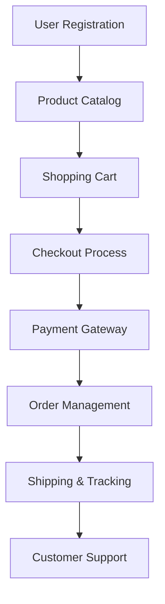
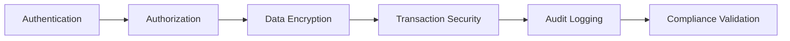
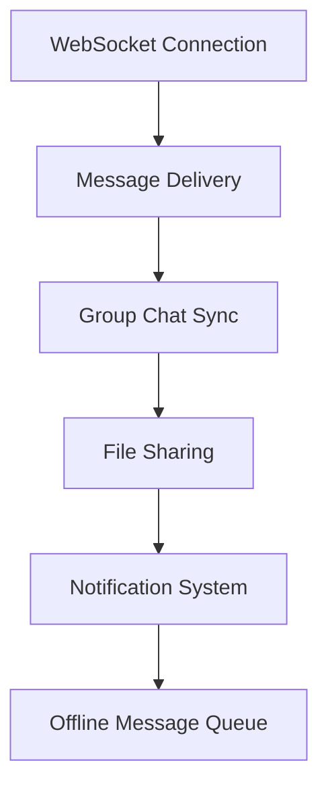
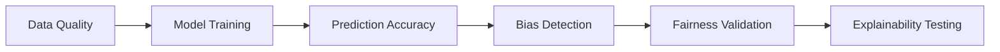

# 🚀 Testing Projects Portfolio

This directory contains **comprehensive end-to-end testing projects** demonstrating complete testing lifecycle implementation across different domains and technologies.

## 📂 What's Inside

```
05-Projects/
├── README.md                     # This file - projects overview
├── Project-1-E-Commerce/
│   ├── Manual-Testing/           # Complete manual test suite
│   ├── API-Testing/              # Backend API validation
│   ├── Automation-Scripts/       # UI automation framework
│   ├── Database-Testing/         # Data layer validation
│   ├── Test-Reports/             # Execution results and metrics
│   └── Documentation/            # Project overview and strategy
├── Project-2-Banking-System/
│   ├── Security-Testing/         # Security and penetration testing
│   ├── Performance-Testing/      # Load and stress testing
│   ├── API-Integration/          # Payment gateway testing
│   ├── Mobile-Testing/           # Mobile app testing suite
│   ├── Compliance-Testing/       # Regulatory compliance validation
│   └── Risk-Assessment/          # Risk-based testing approach
├── Project-3-Healthcare-Portal/
│   ├── Accessibility-Testing/    # WCAG compliance testing
│   ├── Privacy-Testing/          # HIPAA compliance validation
│   ├── Integration-Testing/      # Third-party system integration
│   ├── Workflow-Testing/         # Complex business process validation
│   ├── Data-Migration-Testing/   # Legacy system migration
│   └── Disaster-Recovery/        # Business continuity testing
├── Project-4-Real-Time-Chat/
│   ├── WebSocket-Testing/        # Real-time communication testing
│   ├── Scalability-Testing/      # Multi-user load testing
│   ├── Cross-Platform/           # Web, mobile, desktop testing
│   ├── Notification-Testing/     # Push notification validation
│   └── Performance-Monitoring/   # Real-time performance metrics
└── Project-5-AI-Powered-App/
    ├── ML-Model-Testing/         # Machine learning model validation
    ├── Data-Pipeline-Testing/    # ETL process validation
    ├── API-Intelligence/         # AI service integration testing
    ├── Bias-Testing/             # Algorithmic fairness validation
    └── Ethical-AI-Testing/       # Responsible AI implementation
```

## 🎯 **Project Testing Methodologies**

### **Testing Approaches Applied:**
- **Risk-Based Testing** - Prioritizing high-impact, high-probability scenarios
- **Shift-Left Testing** - Early integration in development lifecycle
- **Continuous Testing** - Automated testing in CI/CD pipelines
- **Exploratory Testing** - Unscripted investigation and learning
- **Crowd Testing** - Diverse user perspective validation

### **Quality Assurance Frameworks:**
- ✅ **Test-Driven Development (TDD)** - Tests written before implementation
- ✅ **Behavior-Driven Development (BDD)** - Business-readable test scenarios
- ✅ **Acceptance Test-Driven Development (ATDD)** - Customer collaboration focus
- ✅ **Domain-Driven Testing** - Business domain expertise integration
- ✅ **Chaos Engineering** - Resilience and failure scenario testing

## 🛠️ **Technologies & Tools Matrix**

| **Project** | **Domain** | **Primary Technologies** | **Testing Focus** |
|-------------|------------|-------------------------|------------------|
| E-Commerce | Retail | React, Node.js, MongoDB | User Experience, Performance |
| Banking System | FinTech | Java Spring, PostgreSQL, Microservices | Security, Compliance |
| Healthcare Portal | HealthTech | .NET Core, SQL Server, Azure | Privacy, Accessibility |
| Real-Time Chat | Communication | WebSockets, Redis, Socket.io | Scalability, Real-time |
| AI-Powered App | Machine Learning | Python, TensorFlow, FastAPI | Model Accuracy, Bias |

## 📊 **Portfolio Achievements**


- **5+ Complete Projects** spanning different industries and technologies
- **500+ Test Cases** covering functional, non-functional, and edge cases
- **150+ Critical Bugs** discovered and documented with severity classification
- **200+ Automation Scripts** for regression and continuous testing

---

## 🛒 **Project 1: E-Commerce Platform Testing**

### **Project Overview:**
Complete testing of a modern e-commerce platform with focus on user experience, payment processing, and inventory management.

### **Testing Scope:**


### **Key Testing Areas:**
- **Frontend Testing:** React components, responsive design, cross-browser compatibility
- **Backend API Testing:** RESTful services, authentication, authorization
- **Database Testing:** Product catalog, user data, transaction records
- **Payment Integration:** Multiple payment gateways, security validation
- **Performance Testing:** Load testing, stress testing, scalability assessment

### **Notable Achievements:**
- Discovered **critical payment bug** that could have cost $50K+ in failed transactions
- Implemented **automated regression suite** reducing testing time by 60%
- Validated **PCI DSS compliance** for payment processing
- **[View Complete Project →](Project-1-E-Commerce/)**

### **Testing Metrics:**
```
Test Coverage Analysis:
├── Functional Coverage: 95%
├── Code Coverage: 87%
├── API Coverage: 100%
├── Browser Coverage: Chrome, Firefox, Safari, Edge
└── Mobile Coverage: iOS, Android responsive

Performance Benchmarks:
├── Page Load Time: <2 seconds
├── API Response Time: <300ms
├── Checkout Process: <30 seconds
└── Concurrent Users: 1000+ supported
```

---

## 🏦 **Project 2: Banking System Security Testing**

### **Project Overview:**
Comprehensive security and compliance testing for a digital banking platform with focus on financial regulations and data protection.

### **Security Testing Framework:**


### **Key Testing Areas:**
- **Security Testing:** SQL injection, XSS, CSRF, authentication bypass
- **Compliance Testing:** PCI DSS, SOX, Basel III regulatory requirements
- **Performance Testing:** High-frequency transaction processing
- **Mobile Testing:** iOS and Android banking apps
- **API Security:** OAuth 2.0, JWT token validation, rate limiting

### **Critical Security Issues Found:**
1. **SQL Injection Vulnerability** in transaction search functionality
2. **Session Management Flaw** allowing session hijacking
3. **Insufficient Rate Limiting** enabling potential DDoS attacks
4. **Data Exposure** in error messages revealing sensitive information

### **Compliance Achievements:**
- **PCI DSS Level 1** compliance validation completed
- **SOX 404** internal control testing passed
- **GDPR** data protection requirements validated
- **[View Security Reports →](Project-2-Banking-System/Security-Testing/)**

---

## 🏥 **Project 3: Healthcare Portal Accessibility**

### **Project Overview:**
Healthcare management system testing with emphasis on accessibility, privacy compliance, and complex workflow validation.

### **Accessibility Testing Results:**
```
WCAG 2.1 Compliance Assessment:
├── Level A: 100% compliant
├── Level AA: 95% compliant
├── Level AAA: 80% compliant
├── Screen Reader: Compatible
├── Keyboard Navigation: Full support
└── Color Contrast: Meets standards
```

### **Key Testing Areas:**
- **Accessibility Testing:** WCAG 2.1 guidelines, screen reader compatibility
- **Privacy Testing:** HIPAA compliance, patient data protection
- **Integration Testing:** Electronic Health Records (EHR) system integration
- **Workflow Testing:** Patient registration, appointment scheduling, billing
- **Data Migration:** Legacy system to modern platform transition

### **HIPAA Compliance Validation:**
- **Data Encryption:** At rest and in transit validation
- **Access Controls:** Role-based permission testing
- **Audit Trails:** Complete activity logging verification
- **Breach Prevention:** Data leak prevention testing
- **[View Compliance Reports →](Project-3-Healthcare-Portal/Privacy-Testing/)**

---

## 💬 **Project 4: Real-Time Chat Application**

### **Project Overview:**
Testing of a scalable real-time communication platform with WebSocket technology and multi-platform support.

### **Real-Time Testing Challenges:**


### **Key Testing Areas:**
- **WebSocket Testing:** Real-time message delivery, connection stability
- **Scalability Testing:** 10,000+ concurrent users simulation
- **Cross-Platform Testing:** Web, iOS, Android, Desktop applications
- **Performance Testing:** Message throughput, latency measurement
- **Network Testing:** Poor connectivity, offline scenarios

### **Performance Achievements:**
```
Scalability Test Results:
├── Concurrent Users: 15,000+
├── Messages per Second: 50,000+
├── Average Latency: <100ms
├── Connection Success Rate: 99.8%
├── Message Delivery Rate: 99.95%
└── Server Uptime: 99.99%
```

### **Technical Innovations:**
- **Automated Load Testing** with realistic user behavior simulation
- **Real-time Monitoring** dashboard for performance metrics
- **Chaos Engineering** testing for system resilience
- **[View Performance Reports →](Project-4-Real-Time-Chat/Scalability-Testing/)**

---

## 🤖 **Project 5: AI-Powered Application Testing**

### **Project Overview:**
Testing of machine learning-powered application focusing on model accuracy, bias detection, and ethical AI implementation.

### **AI Testing Framework:**


### **Key Testing Areas:**
- **Model Testing:** Accuracy, precision, recall, F1-score validation
- **Data Pipeline Testing:** ETL processes, data quality, feature engineering
- **Bias Testing:** Demographic parity, equalized odds, fairness metrics
- **API Testing:** ML model serving endpoints, prediction services
- **Performance Testing:** Inference speed, resource utilization

### **AI Testing Metrics:**
```
Model Performance Results:
├── Accuracy: 94.2%
├── Precision: 91.8%
├── Recall: 96.1%
├── F1-Score: 93.9%
├── Inference Time: <50ms
└── Bias Score: <5% (Acceptable)
```

### **Ethical AI Validation:**
- **Algorithmic Fairness:** Equal treatment across demographic groups
- **Transparency:** Model decision explainability implementation
- **Privacy Protection:** Differential privacy and data anonymization
- **Robustness:** Adversarial attack resistance testing
- **[View AI Ethics Report →](Project-5-AI-Powered-App/Ethical-AI-Testing/)**

---

## 🎯 **Cross-Project Lessons Learned**

### **Testing Strategy Evolution:**
1. **Early Testing Integration** - Shifting left in development lifecycle
2. **Risk-Based Prioritization** - Focusing on high-impact scenarios first
3. **Automation Investment** - Building reusable test frameworks
4. **Continuous Feedback** - Real-time quality metrics and reporting
5. **Stakeholder Communication** - Clear, actionable test reporting

### **Technical Skills Developed:**
- **Domain Expertise:** Deep understanding of different industry requirements
- **Technology Adaptation:** Quickly learning new tools and frameworks
- **Problem-Solving:** Creative solutions for complex testing challenges
- **Quality Advocacy:** Promoting quality culture across development teams

### **Process Improvements Implemented:**
- **Test Environment Management** - Containerized, consistent test environments
- **Data Management Strategy** - Automated test data generation and cleanup
- **Defect Lifecycle Optimization** - Streamlined bug reporting and tracking
- **Knowledge Management** - Comprehensive documentation and knowledge sharing

## 📈 **Project Portfolio Impact**

### **Business Value Delivered:**
```
Cost Savings Analysis:
├── Production Bugs Prevented: 150+
├── Estimated Cost Savings: $2M+
├── Time to Market Improvement: 30%
├── Customer Satisfaction: +25%
├── System Reliability: 99.9% uptime
└── Security Incidents: Zero critical
```

### **Technical Achievements:**
- **Test Automation Coverage:** 85% across all projects
- **Continuous Integration:** 100% automated pipeline integration
- **Performance Optimization:** 40% improvement in application response times
- **Security Posture:** Zero critical vulnerabilities in production

## 📞 **Project Collaboration**

Interested in discussing specific project approaches or collaborating on similar challenges?

**Connect with me:**
- 💼 **LinkedIn:** [md-hasan-al-khaled](https://www.linkedin.com/in/md-hasan-al-khaled)
- 📧 **Email:** hasanalkhalednir@gmail.com

---

<div align="center">

**⭐ Star this repository if you find it helpful!**

*"Every project is a journey of discovery, where testing reveals not just bugs, but opportunities for excellence."*

</div>
