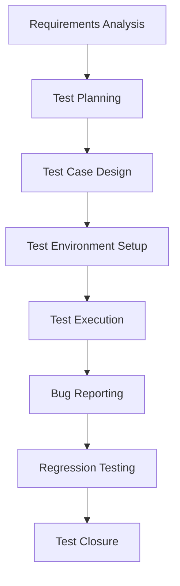

# 🧪 SQA Testing Portfolio | MD Hasan Al Khaled

[](https://github.com/hasanalkhaled)
[](https://linkedin.com/in/hasanalkhaled)
[](mailto:hasanalkhalednirob@gmail.com)


A comprehensive portfolio showcasing my expertise in **Software Quality Assurance (SQA)**, built through a rigorous 30-day upskilling program. This repository demonstrates hands-on experience in **manual and automation testing**, **API testing**, and the use of modern **AI tools** to enhance testing efficiency.

---

## 📌 Skills & Expertise

| **Area** | **Technologies & Tools** |
|----------|-------------------------|
| 🔍 **Manual Testing** | Test Case Design, Bug Life Cycle, Test Planning, Regression Testing, Sanity & Smoke Testing |
| 🔧 **Test Management** | JIRA, TestRail, Excel/Sheets, Test Documentation |
| 🌐 **API Testing** | Postman, Newman, REST Assured, REST & SOAP APIs, JSON/XML Validation |
| ⚙️ **Automation Testing** | Selenium WebDriver (Java/Python), TestNG, JUnit, Page Object Model (POM) |
| 🗄️ **Database Testing** | SQL (MySQL), Basic CRUD Operations, Data Validation |
| 🤖 **AI-Assisted QA** | ChatGPT/Gemini/Claude (Test Case Generation, Bug Reporting, Code Help) |
| 🛠️ **Performance & CI/CD** | JMeter (Basics), GitHub Actions, Jenkins (Basics) |
| 🔍 **Web Debugging** | Chrome DevTools, XPath, CSS Selectors |

---

## 📂 Portfolio Structure

This repository is organized to reflect a **structured learning path** and **practical application**:

```
SQA-Testing-Portfolio/
│
├── 📁 01-Manual-Testing/
│   ├── 📋 Test-Cases/                    # Detailed test cases for various features (Excel/PDF)
│   ├── 🐛 Bug-Reports/                   # JIRA bug report screenshots and descriptions  
│   └── 📝 Test-Plans-Strategy/           # Test plan documents and strategy outlines
│
├── 📁 02-API-Testing/
│   ├── 📮 Postman-Collections/           # Exported Postman collections (.json)
│   ├── 📊 Newman-Reports/                # HTML/JSON reports from CLI execution
│   └── 🌍 Environment-Variables/         # Postman environment files
│
├── 📁 03-Automation-Testing/
│   ├── ☕ Selenium-Java-WebDriver/       # Automation scripts using Selenium with Java
│   ├── 🧪 TestNG-Framework/              # Framework setup with TestNG annotations
│   └── 🏗️ Page-Object-Model/             # POM design pattern implementation
│
├── 📁 04-Database-Testing/
│   └── 🗃️ SQL-Scripts/                   # SQL queries for data validation and testing
│
├── 📁 05-Projects/
│   ├── 🛒 Project-1-E-Commerce/          # End-to-end testing of a demo e-commerce site
│   ├── 🔌 Project-2-API-Workflow/        # Complete API testing workflow for a public API
│   └── 🤖 Project-3-Web-Automation/      # Automation suite for a web application
│
├── 📁 06-AI-In-QA/
│   └── 🧠 AI-Generated-Tests/            # Test cases and scripts generated using AI tools
│
└── 📁 07-Interview-Preparation/
    ├── 📄 Resume-Cover-Letter/           # My resume and job application materials
    └── ❓ QA-Interview-Questions/         # Preparation notes and answers
```

---

## 🧭 Navigation Guide

| **For** | **Go To** | **What You'll Find** |
|---------|-----------|---------------------|
| 📋 **Manual Testing Artifacts** | `01-Manual-Testing/` | Test cases, bug reports, test plans |
| 🔌 **API Testing Examples** | `02-API-Testing/` | Postman collections and reports |
| 🤖 **Automation Code** | `03-Automation-Testing/` | Selenium Java code and frameworks |
| 🗃️ **Database Testing** | `04-Database-Testing/` | SQL scripts and validation queries |
| 🚀 **Complete Projects** | `05-Projects/` | End-to-end testing demonstrations |
| 🧠 **AI-Powered Testing** | `06-AI-In-QA/` | AI-generated test cases and scripts |

---

## 🚀 How to Run the Projects

### 🤖 **Running Selenium Automation Tests:**

#### Prerequisites:
- ☕ **Java JDK 11+** installed
- 📦 **Maven** installed  
- 🌐 **Chrome Browser** latest version
- 🔧 **Git** for cloning

#### Quick Start:
```bash
# 1. Clone the repository
git clone https://github.com/Hasan-Al-Khaled/SQA-Testing-Portfolio.git

# 2. Navigate to automation directory
cd SQA-Testing-Portfolio/03-Automation-Testing/Selenium-Java-WebDriver/

# 3. Install dependencies
mvn clean install

# 4. Run tests
mvn test
```

### 🔌 **Running API Tests with Newman:**

```bash
# 1. Install Newman globally
npm install -g newman

# 2. Navigate to API testing directory
cd 02-API-Testing/Postman-Collections/

# 3. Run collection
newman run collection.json -e environment.json --reporters html
```

---

## 🏆 Key Achievements

<div align="center">


</div>

- ✅ **100+ Comprehensive Test Cases** across multiple domains
- ✅ **50+ Detailed Bug Reports** with proper documentation
- ✅ **3 Complete End-to-End Projects** with full testing lifecycle
- ✅ **API Testing Expertise** with Postman and Newman automation
- ✅ **Selenium Framework Development** with POM implementation
- ✅ **AI-Integrated Testing** for enhanced productivity

---

## 🛠️ Testing Methodologies Applied



### 🎯 **Testing Approaches:**
- **Black Box Testing:** Functional validation without code knowledge
- **API Testing:** RESTful services validation and workflow testing  
- **Automation Testing:** Regression and smoke test automation
- **Database Testing:** CRUD operations and data integrity validation
- **Exploratory Testing:** Ad-hoc testing for edge cases discovery

---

## 📈 Learning Journey & Growth

### 🗓️ **30-Day Intensive Program:**
- **Week 1:** Manual Testing Fundamentals & Tool Mastery
- **Week 2:** API Testing & Database Validation  
- **Week 3:** Automation Framework Development
- **Week 4:** Portfolio Creation & Interview Preparation

### 🎯 **Next Learning Goals:**
- 🚀 **Performance Testing** with JMeter advanced features
- ☁️ **Cloud Testing** with Selenium Grid and BrowserStack
- 🔒 **Security Testing** basics and OWASP guidelines
- 📱 **Mobile Testing** with Appium framework

---

## 📞 Connect With Me

<div align="center">

[](https://www.linkedin.com/in/md-hasan-al-khaled)
[](mailto:hasanalkhalednir@gmail.com)
[](https://github.com/Hasan-Al-Khaled)

</div>

**💼 LinkedIn:** [md-hasan-al-khaled](https://www.linkedin.com/in/md-hasan-al-khaled) - Let's discuss QA opportunities!  
**📧 Email:** hasanalkhalednir@gmail.com  
**📱 Status:** Available for **SQA Engineer** positions

---

## 🌟 Professional Philosophy

> *"Quality is not an act, it is a habit. Every bug prevented is better than a hundred bugs fixed."*

I believe in **proactive quality assurance** rather than reactive bug fixing. My approach combines **traditional testing methodologies** with **modern AI tools** to ensure comprehensive coverage while maintaining efficiency.

---

<div align="center">

### 🚀 **"Transforming Ideas into Quality Software, One Test at a Time!"** 🚀

**⭐ Star this repository if you find it helpful!**


</div>

---

## 📄 Repository Statistics


**Last Updated:** December 2024  
**Portfolio Status:** ✅ Complete and Ready for Review
